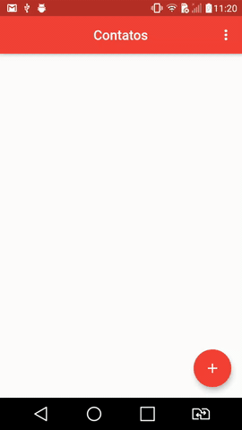

 <p align="center">
      
</p>

<h1 align="center">Contacts</h1>

   <h2 align="center">Topics 📋</h2>

   <p>
   
   - [About 📖](#about-)
   - [Preview 📱](#preview-)
   - [Challenges and Learnings along the way 🤯](#challenges-and-learnings-along-the-way-)
   - [How to Use 🤔](#how-to-use-)
   - [How to Contribute 💪](#how-to-contribute-)
   - [License 📝](#license-)

   </p>

<h2 align="center">About 📖</h2>
   
<p align="center">   
   A Contact Book made with Flutter. 💙<br>
   A Contact Application, using <a href="https://pub.dev/packages/sqflite">sqflite</a>, a packpage from Flutter. Where you can create, consult, edit and delete, also organize them from A-Z, or from Z-A, put photos (from gallery) and email in your contacts.<br>
   This application is in version 1.2.
</p>

---

<h2 align="center">Preview 📱</h2><br>

   <p align="center">
      
   </p>
   
   > * See all in [`demo`](https://github.com/felipecastrosales/Contacts/tree/master/assets/demos) folder. 🧐📂

---

<h2 align="center">Challenges and Learnings along the way 🤯</h2>

   <p>
      In this application, which is a little more complex, I learned and also reinforced many previous lessons.<br>
      I used new widgets, resources and this example of CRUD (Create, Read, Update and Delete), made me learn a lot, it will certainly be a learning experience that I will take with me in all the technologies that I will learn. <br>
      In this project I also used the SQLite database, with the Flutter plugin, the <a href="https://flutter.dev/docs/cookbook/persistence/sqlite"> sqflite</a>, which will help insert, query, update and delete queries.
   </p>

---

<h2 align="center">How to Use 🤔</h2>

   ```   
   - Clone this repository:
   $ git clone https://github.com/felipecastrosales/Contacts contacts

   - Enter in directory:
   $ cd contacts

   - For install dependencies:
   $ flutter packages get

   - Run the app: 
   $ flutter run
   ```

---

<h2 align="center">How to Contribute 💪</h2>

   ```
   - Fork the project 

   - Create a new branch with your changes:
   $ git checkout -b my-feature

   - Save your changes and create a commit message telling you what you did:
   $ git commit -m "feature: My new feature"

   - Submit your changes:
   $ git push origin my-feature
   ```

---

<h2 align="center">License 📝</h2>

   This repository is under MIT license. You can see the [LICENSE](https://github.com/felipecastrosales/Contacts/blob/master/LICENSE) file for more details. 😉

   ---

   >This project was developed with ❤️ by **[@Felipe Sales](https://www.linkedin.com/in/felipecastrosales/)**, with the instructor **[Daniel Ciolfi](https://linkedin.com/in/danielciolfi)**, in the course  **["Creating Android and iOS Apps with Flutter - Create 16 Apps"](https://www.udemy.com/course/curso-completo-flutter-app-android-ios/?referralCode=1355952A966260D40D18)** on **[Udemy](https://www.udemy.com/)**.<br>
   If it helped you, give ⭐, contribute, it will help me too 😉

---

   <div align="center">

   [](https://www.linkedin.com/in/felipecastrosales/)

   </div>
